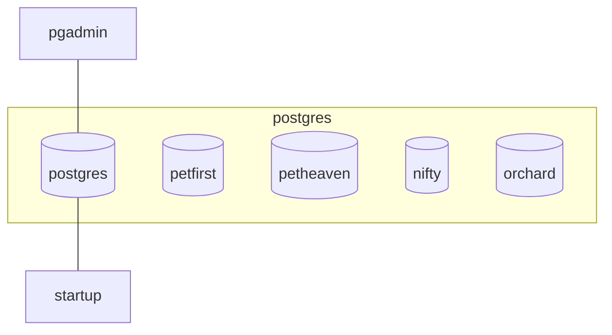
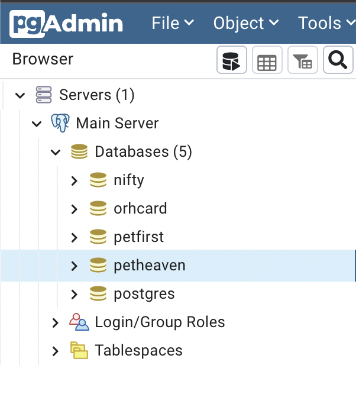

# Setting up multiple postgresql databases a single instance

This is a project to help get up and running with multiple databases in a single postgresql instance. For extra flavour pgadmin has been added to make things a bit easier.


[TOC]

## Arch



The startup container will "always" run after after postgresql container has been brought up and it will provision the databases by running the `runme.sh` script.

## Getting started

### 1 Start the container

```bash
docker-compose up -d
```

### 2 Login into pgAdmin and create a server

2.1 Login in to pgAdmin on `localhost:8001`: 
    username: pgadmin4@pgadmin.com
    password: password

2.2 Add a new server:
    host: postgres_db
    user: postgres
    password: postgres

### 3 Add additional databases

In your newly created server, select the default `postgres` database and open the query tool.
You can then run the SQL script provided to create the additional databases. Refresh your server to view the newly created databases.

Result will be as follows:



